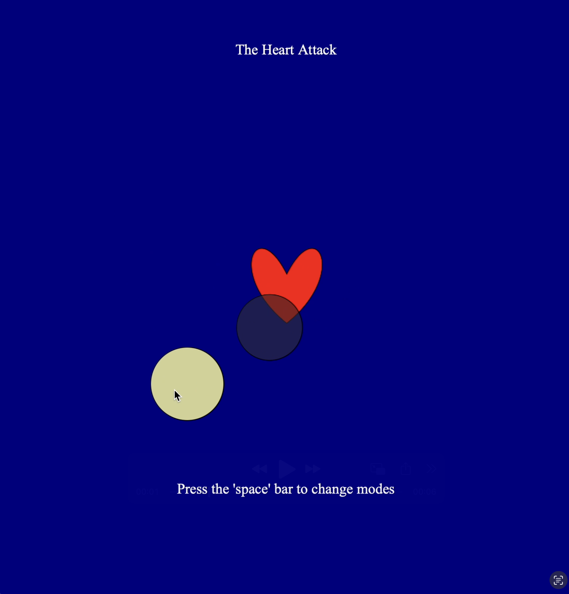
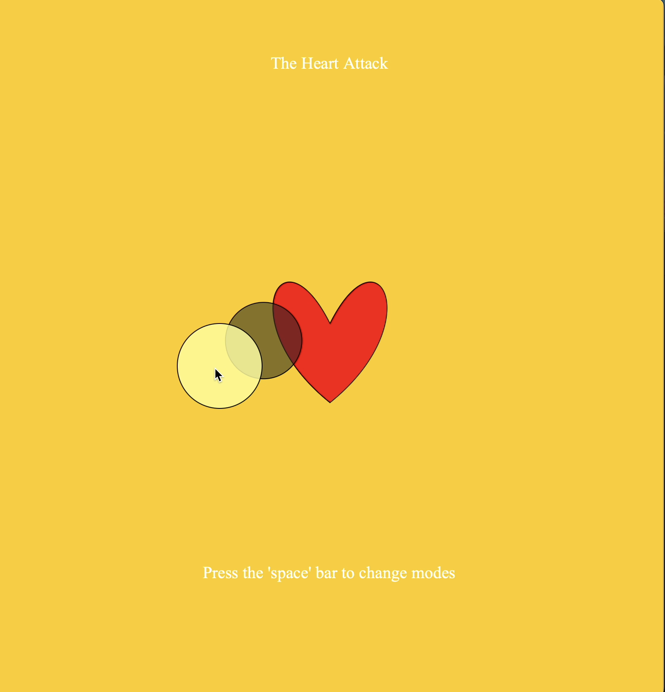

# Experiment 2: Heart Attack 

## [Link to Live Version](https://maniemagz-dotcom.github.io/Creative-coding-portfolio_Amanie_Maguindanao/Experiment_2-Heart_Attack/)

## Documentation

**Inspiration and Description:**
In this experiment, I explored how to make interactive art alongside animation. I wanted to mimic the aesthetic of health apps that visualize a heartbeat and combine it with a fidget game inspired by a flashlight and incorporate it with the mechanical "feel" of a fidget toy. The concept centers on a "heartbeat" with a "flashlight" controlled by the mouse that illuminates a dark environment. By pressing the spacebar, the user can toggle between night and day, effectively changing the context of the piece. To achieve this, I utilized the keyPressed function for the state change and mapped the mouseX and mouseY coordinates to direct the visuals. I also integrated the frameCount method to create the pulsating animation for the heart shape.

**Technical Progress:**
The goal was to move beyond static movement, so I implemented Linear Interpolation (lerp()). This allows the shadow of the light to follow the cursor with a 15% delay, creating an organic feel. During the process, I struggled with the visual depth of the shadow and light. I discovered that adding a fourth value to the fill() function was the fix, which allowed the shadow and light to feel like a soft glow rather than a solid block. Due to the complexity of the geometry of the heart's shape, I sought assistance from Gemini AI to understand how to make the vertex points correctly. This taught me how to combine AI-generated logic with my own interactive code.

**Reflection:**
The most noticeable "cause and effect" discovery was the impact of the boolean toggle.  

When the spacebar is pressed, the background colors shift which completely changes the mood of the piece. 

Refining the movement was my biggest hurdle; I found the shadow's movement too static. By looking back at my lectures on interpolation and watching tutorials, I successfully integrated the lerp() method to achieve the desired smooth animation. This experiment reinforced that technical research, trial and error are crucial for creating a polished and smoother user experience.

**Word Count: 326 words** 
