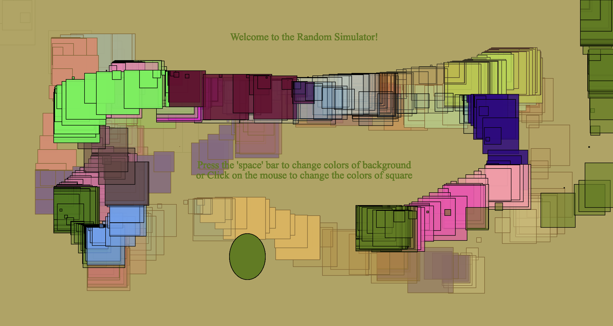
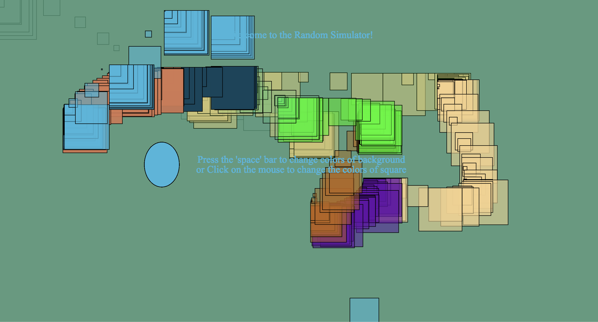

# Experiment 3: The Random Simulator

## [Link to Live Version](https://maniemagz-dotcom.github.io/Creative-coding-portfolio_Amanie_Maguindanao/Experiment_3-Random_Simulator/)

## Documentation

**Inspiration and Description:**
The inspiration for this experiment was a combination of my previous work and a "try it yourself" exercise from a YouTube tutorial by Coding Train. While researching how to implement the random() for Task 4, I had a "eureka moment" when I realized that a trail "glitch" I had accidentally created during the trial-and-error phase of my experiments 1 and 2 could be featured for this experiment. My goal was to create a "Random Simulator" that functions like a generative sketchbook. By setting the background to only change on a keypress, I allow the user to paint with randomness, creating a piece with mouse movement.

**Technical Progress:**
This experiment explores three different "layers" of randomness. First, I used the static randomness by assigning pos = random(300,600) ensuring that the ellipse changes its position every time the program starts and remains stable during execution. Second, I used continuous randomness in the draw() loop to vary the size of the square. Finally, I implemented user-triggered randomness using the keyPressed() and mousePressed() functions. By using random(255) for RGBA values, the user instantly cycles through millions of color combinations for both the shapes and background.

**Reflection:**
The most significant discovery in this process was how the "accidents" could turn into a creative tool. I initially struggled with the "scattering" effect of the squares, but after revisiting my earlier experiments, specifically the second experiment and watching the Coding Train demo, I realized this "trail" allowed for more interactivity. I also struggled with the text placement, but by after textAlign(CENTER, CENTER) and coordinates like width / 2, I was able to keep the instructions readable. The "cause and effect" is clear: the mouse creates the path, while the random() function decides the color and scale of that path.

When the program refreshes, the ellipse moves into a random position. At the same time, the spacebar resets the whole canvas with a random background color.

This experiment taught me that even "mistakes" in code can be translated into a successful feature.   

**Word Count: 328 words** 
