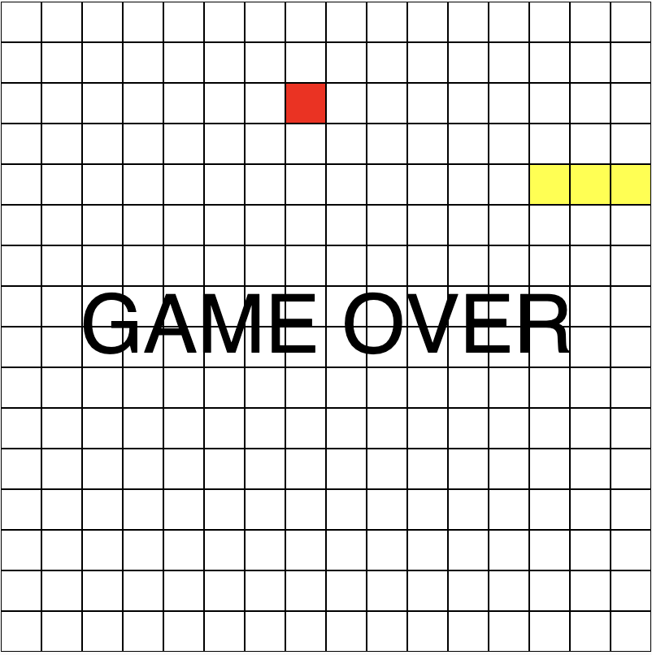
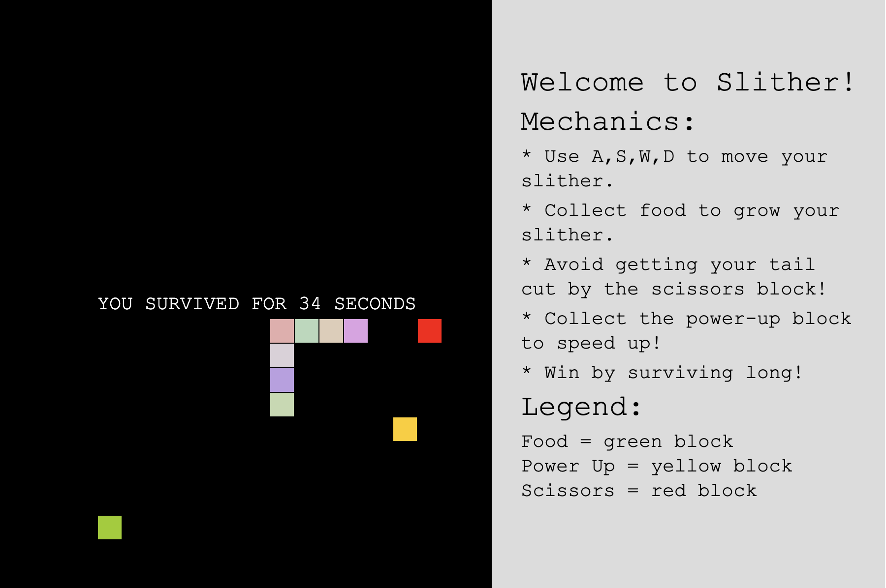

# Experiment 4 : SHOWCASE PIECE - The Slither Game

## [Link to Live Version ](https://maniemagz-dotcom.github.io/Creative-coding-portfolio_Amanie_Maguindanao/Experiment_4-Slither_Game/)

## Documentation

**Inspiration and Description:**
My showcase piece is a remix of Patt Vira's tutorial regarding how to make a snake game using p5.js on YouTube. I chose this tutorial because I was interested in using my prior knowledge of making games in the Godot engine and wanted to try making one in p5.js. My goal was to transform this simple game demo into a "Survival Slither" game with more features. I was inspired by "slither.io" and the arcade game "snake duel" from Zenless Zone Zero for both the features and colors. 

**Technical Progress:**
Although the original code provided the foundation for the segment, I implemented several significant changes. First, I integrated a survival timer (Google Gemini, 2026) to track player's life. I also enhanced the visuals by adding a UI for navigation and instructions. To make the slither look more dynamic, I reused the random() method from my previous experiment to generate a multi-colored body. Second, I made two custom major features: "Scissors" and "Power-up" blocks. The "Scissors block" triggers an element removal that reduces the Slither's length, while the "Power-up" block doubles the slither's speed. Both features introduce a "risk vs. reward" element to the gameplay. Finally, I configured the interactive keys to WASD style to better achieve an arcade style feel. A major challenge I faced was managing the survival timer's state. Initially, the timer continued running after game-over. By implementing the noLoop() method, I successfully synchronized the program with the player's loss. 

**Reflection:**
This project shows a significant variation from the source material by adding a survival timer and interactive blocks. 

Patt Vira's Snake Game:

My version, The Slither Game:

Through this remix, I discovered that working with a pre-existing structure is crucial, as it provides the "backbone" to build on. This experience taught me how to read, adopt and expand on professional code structures. This has been essential in showing me how to develop external sources with my own creativity.

## Reference List 

Google Gemini (2026) Response to prompt: "make me a survival timer for my slither game". Available at: https://gemini.google.com/ (Accessed: 6 January 2026).

Vira, P. (2023) *p5.js Coding Tutorial | Snake Game*. Available at: https://youtu.be/fTKUPehFF2A?si=oRlNNvSctK0vUUt4 (Accessed: 6 January 2026).

**Word Count: 320 words**