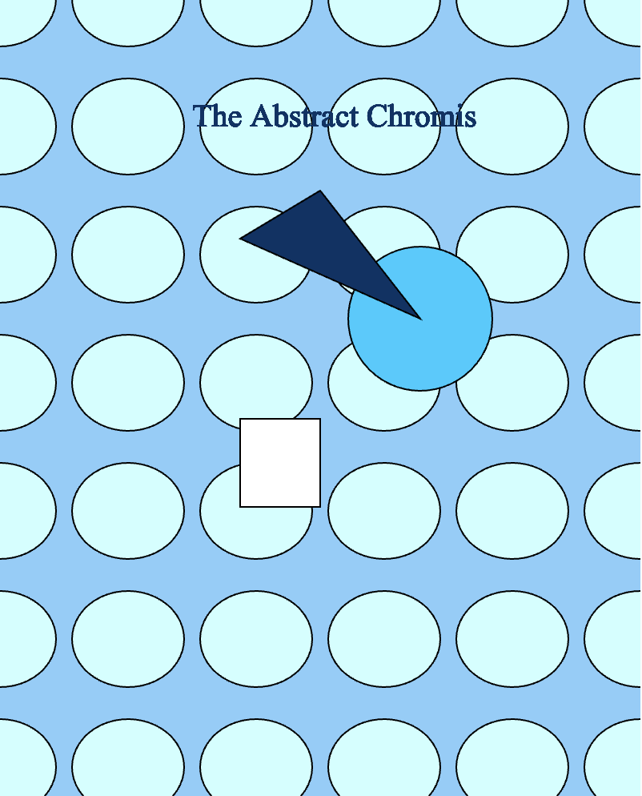
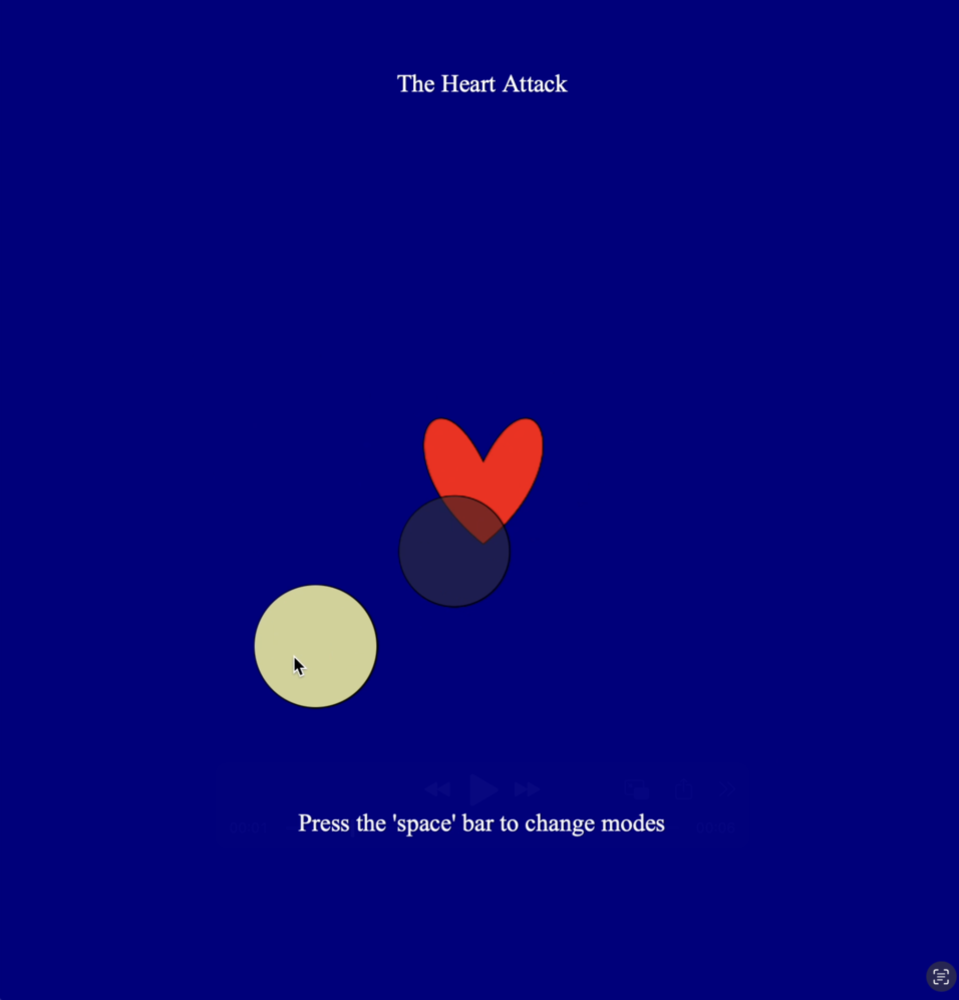

# Creative Coding Portfolio by Amanie Maguindanao

 Welcome to my collection of p5.js sketches/experiments for Creative Coding Course!

 *Click on the photo to view documentation*

| Experiment 1 | Experiment 2 |
| ---- | ---- |
 | 

| Experiment 3 | Showcase Piece (Experiment 4) |
| ---- | ---- |
 | 